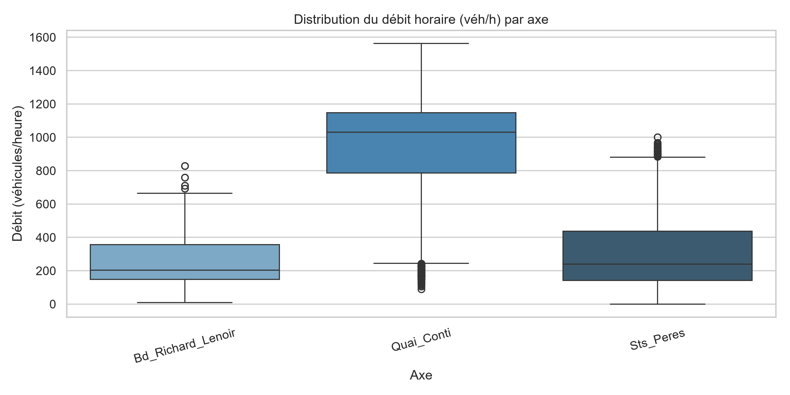
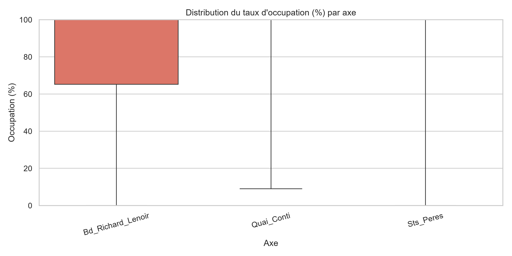
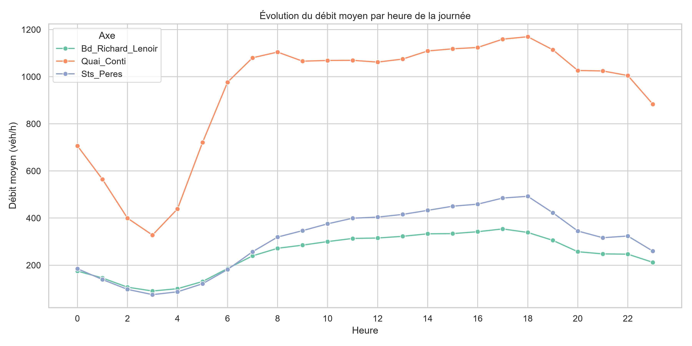
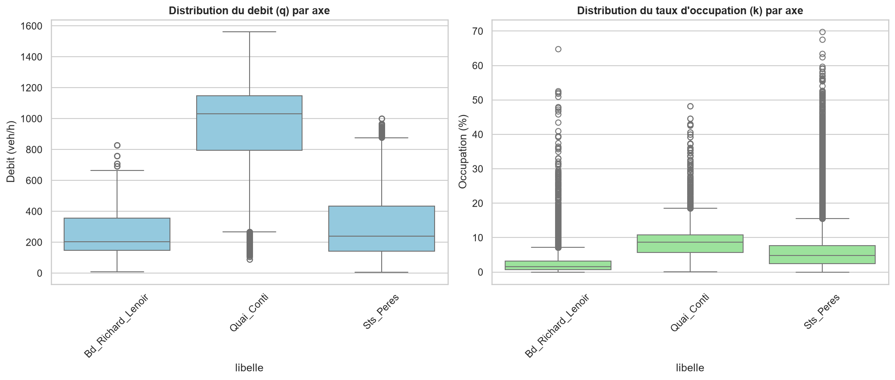
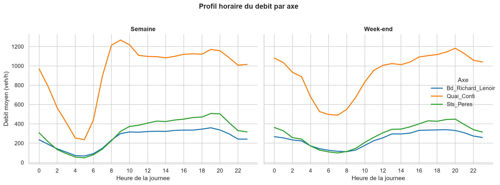
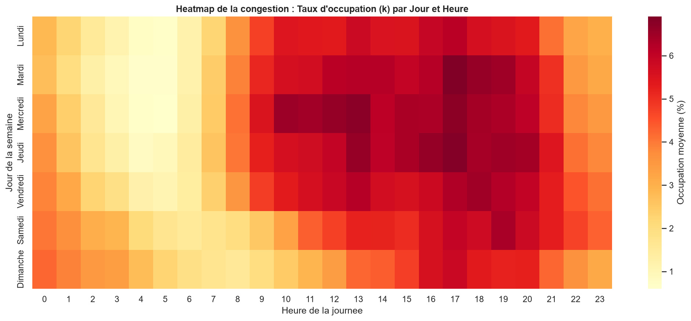
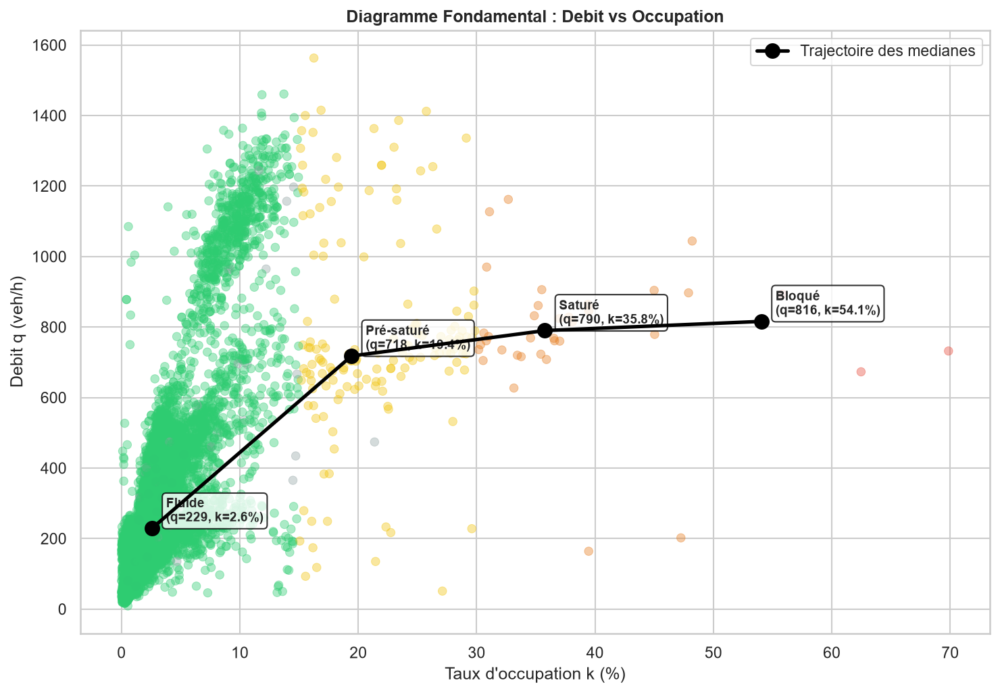
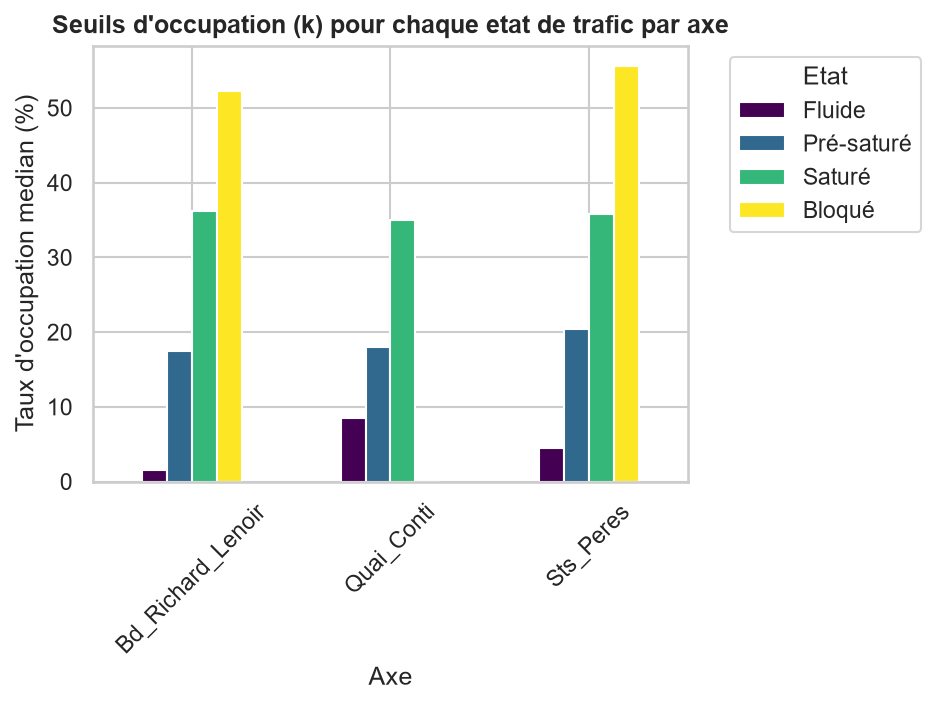

# Analyse du Trafic Routier a Paris : 3 Axes Structurants

**Projet de Data Science - Aivancity**
**Auteur :** Fred Youaleu
**Depot :** [github.com/Fred-Youaleu/Projet_Trafic](https://github.com/Fred-Youaleu/Projet_Trafic)

---

## Contexte et Problematique

La ville de Paris dispose de centaines de capteurs de trafic permanents qui mesurent en continu le debit et le taux d'occupation des axes routiers. Ce projet vise a **comprendre la dynamique du trafic** sur trois axes parisiens aux profils tres differents :

- **Boulevard Richard Lenoir** (11eme) - Axe structurant nord-sud
- **Quai Conti** (6eme) - Axe touristique et commercial en bord de Seine
- **Rue des Saints-Peres** (6eme/7eme) - Axe de liaison inter-arrondissements

**Question centrale :** *Comment evoluent les profils de congestion et de debit sur ces trois axes, et dans quelle mesure les etats declares par les capteurs refletent-ils la realite physique du trafic ?*

---

## Les Donnees

| Caracteristique | Detail |
|-----------------|--------|
| **Source** | OpenData Paris - Comptages routiers permanents |
| **Periode** | Donnees horaires sur plusieurs mois |
| **Volume** | ~69 824 mesures (apres filtrage) |
| **Variables cles** | `q` (debit veh/h), `k` (occupation %), `etat_trafic`, `etat_barre`, `t_1h` (heure Paris) |
| **Capteurs** | 15 capteurs uniques retenus sur les 3 axes (apres deduplication) |

---

## Methodologie

Le projet s'est deroule en etapes successives, chacune correspondant a un notebook dedie :

### Jalon M1 - Chargement et Premiere Exploration (`projet_Trafic.ipynb`)
- Chargement du CSV brut et identification des colonnes.
- Detection des premieres incoherences (etats "Inconnu", "Invalide", debits aberrants).
- Premieres visualisations pour comprendre la structure et la qualite des donnees brutes.

### Jalon M2 - Nettoyage et Preparation (`Rendu 2.ipynb`)
- **Formatage des types** : `t_1h` en datetime (fuseau Paris), etats en categorie.
- **Deduplication** : Exclusion du capteur 70 du Quai Conti, dont les mesures etaient strictement identiques a celles du capteur 69, afin d'eviter tout double comptage dans les agregations.
- **Traitement des valeurs manquantes** :
  - Identification des etats "Inconnu"/"Invalide" comme incertitudes de classification ou defauts de mesure.
  - Interpolation lineaire **par tronçon (`iu_ac`)** pour les trous courts (<= 3h, soit 99.4% des cas), preservant la dynamique propre a chaque capteur.
  - Conservation des NaN pour les trous longs (> 3h) pour eviter l'invention de donnees (biais artificiel).
- **Limites physiques** : plafonnement de `k` entre 0 et 100%, gestion des debits negatifs.

### Jalon M3 - Analyse Exploratoire (`Rendu 3.ipynb`)
- **Variables temporelles** : extraction de l'heure, jour de semaine, indicateur week-end.
- **Encodage** :
  - `etat_trafic` -> encodage ordinal (Fluide=0, Pre-sature=1, Sature=2, Bloque=3) apres validation de l'ordre par la mediane de `k`.
  - `etat_barre` -> one-hot encoding.
- **Valeurs aberrantes** : comparaison IQR vs limites physiques -> decision de conserver les valeurs physiquement plausibles (pics de trafic reels).
- **Statistiques descriptives** : calcul des indicateurs **par tronçon (`iu_ac`)** et focalisation sur les **heures de pointe** (8h-10h et 17h-19h).

### Rendu Final - Visualisations Strategiques
- **Profil horaire** : comparaison Semaine vs Week-end.
- **Heatmap de la congestion** : cartographie visuelle des periodes de tension maximale (jour x heure).
- **Diagramme Fondamental** : relation physique entre debit et occupation, avec trajectoire des medianes par etat de trafic.
- **Analyse des seuils de basculement** : determination des taux d'occupation critiques pour chaque etat et chaque axe.

---

## Resultats

### Phase 1 : Exploration initiale des donnees brutes (Jalon M1)
Avant tout nettoyage, les premieres visualisations ont permis d'identifier la structure globale et les anomalies majeures du jeu de donnees.

**1. Distribution brute du debit**

Le debit brut presente une forte dispersion avec des valeurs extremes, necessitant une verification des limites physiques des capteurs.

**2. Distribution brute de l'occupation**

Le taux d'occupation (`k`) montre egalement des valeurs incoherentes (superieures a 100% ou negatives) qui seront corrigees lors du nettoyage.

**3. Profil horaire global**

Meme sur les donnees brutes, une cyclicite journaliere est deja visible, confirmant la pertinence d'une analyse temporelle approfondie.

### Phase 2 : Distributions apres nettoyage (Jalon M2 / M3)
Apres l'application des regles de nettoyage, les distributions sont assainies et exploitables.

**4. Distribution du debit et de l'occupation par axe**

- **Bd Richard Lenoir** : mediane ~204 veh/h, max 828 veh/h - axe a fort volume mais stable.
- **Quai Conti** : mediane ~1032 veh/h, max 1563 veh/h - trafic dense avec pics marques (capteur 69 unique retenu).
- **Sts Peres** : mediane ~240 veh/h, max 1001 veh/h - variabilite importante.

### Phase 3 : Dynamiques temporelles et congestion
**5. Profil horaire : Semaine vs Week-end**

- **Effet week-end** : les pics de 9h et 18h disparaissent totalement le samedi et dimanche, confirmant un trafic a **dominante professionnelle**.
- **Comportement des axes** : le Bd Richard Lenoir subit la chute la plus brutale (axe de transit pur), tandis que le Quai Conti maintient un debit plus stable (tourisme/commerce).

**6. Heatmap de la congestion**

La congestion (taux d'occupation `k`) est maximale **du lundi au vendredi, entre 8h-10h et 17h-19h**. Le week-end, la carte s'eclaircit drastiquement, validant l'absence de saturation structurelle hors jours ouvres.

### Phase 4 : Physique du trafic et seuils
**7. Diagramme Fondamental : Debit vs Occupation**

La trajectoire des medianes (ligne noire) revele la physique du trafic : le debit augmente avec l'occupation jusqu'a un point de capacite maximale (Pre-sature), puis s'effondre lorsque la congestion devient severe (Bloque).

**8. Seuils de basculement par axe**


| Etat | Bd Richard Lenoir | Quai Conti | Sts Peres |
|------|-------------------|------------|-----------|
| Fluide | 1.59% | 8.47% | 4.46% |
| Pre-sature | 17.53% | 18.04% | 20.41% |
| Sature | 36.27% | 35.04% | 35.87% |
| Bloque | 52.22% | **NaN** | 55.56% |

**Constat cle** : les seuils sont remarquablement stables d'un axe a l'autre (~17-20% pour Pre-sature, ~35-36% pour Sature), validant l'homogeneite de la physique du trafic. L'absence de valeur (`NaN`) pour l'etat "Bloque" sur le Quai Conti reflete simplement que ce niveau de congestion extreme n'a pas ete atteint sur ce troncon durant la periode analysee. 
---

## Limites

- **Trous de mesure** : les etats "Inconnu" (souvent la nuit) ont ete interpolés. Les trous > 3h restent en `NaN` par choix methodologique pour eviter les biais.
- **Redondance initiale de capteurs** : les capteurs 69 et 70 du Quai Conti renvoyaient des mesures strictement identiques (duplication probable au niveau de la collecte). Le capteur 70 a ete exclu des analyses pour garantir l'integrite des agregations.


## Utilisation de l'IA

Conformément aux règles du module, l'utilisation de l'IA générative a été déclarée et encadrée comme suit :

- **Outil utilisé** : Assistant IA conversationnel (LLM).
- **À quoi cela m'a servi concrètement** :
  1. **Structuration et relecture** : Amélioration de la clarté du code, affinage des interprétations textuelles pour garantir la rigueur scientifique.
  2. **Gestion du versioning avec Git** : L'IA m'a accompagné dans la rédaction des commandes Git (`git add`, `git commit`, `git push`) compte tenu du fait que je ne l'avais jamais fait avant pour suivre l'évolution du projet sur GitHub.
  
- **Modifications apportées** : Toutes les suggestions générées par l'IA ont été systématiquement vérifiées, validées et adaptées manuellement dans le code pour garantir la cohérence métier et l'exactitude des résultats présentés dans ce projet.

---

## Lancer le projet

```bash
# 1. Cloner le depot
git clone https://github.com/Fred-Youaleu/Projet_Trafic.git
cd Projet_Trafic

# 2. Installer les dependances
pip install -r requirements.txt

# 3. Telecharger les donnees (script de reproductibilite)
python download_data.py

# 4. Executer les notebooks dans l'ordre chronologique :
#    - projet_Trafic.ipynb : Chargement et premiere exploration (M1)
#    - Rendu 2.ipynb       : Nettoyage et preparation des donnees (M2)
#    - Rendu 3.ipynb       : Analyse exploratoire et visualisations (M3)
#    - Rendu Final 4.ipynb       : Analyse exploratoire et visualisations (M4)
